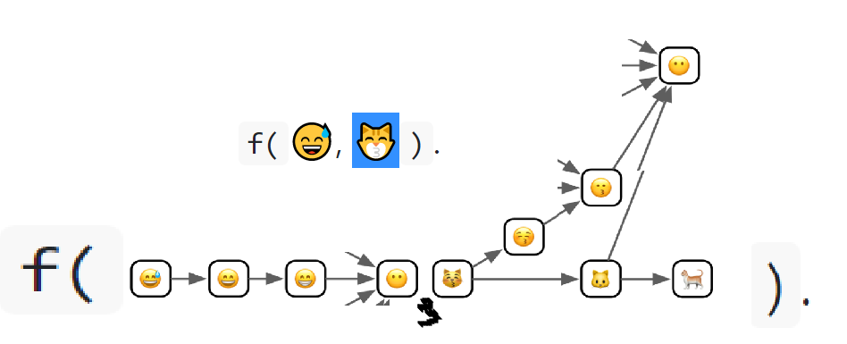

```{r setup, include=FALSE}
knitr::opts_chunk$set(echo = TRUE)
```

# 15. S4
## 15.1 Introduction

```{r}
library(methods)
library(tidyverse)
```

## 15.2 Basics

```{r}
setClass("Person", 
  slots = c(
    name = "character", 
    age = "numeric"
  )
)
```

```{r}
john <- new("Person", name = "John Smith", age = NA_real_)
```

```{r}
is(john)
john@name
slot(john, "age")
```

```{r}
setGeneric("age", function(x) standardGeneric("age"))
setGeneric("age<-", function(x, value) standardGeneric("age<-"))
```

```{r}
setMethod("age", "Person", function(x) x@age)
setMethod("age<-", "Person", function(x, value) {
  x@age <- value
  x
})

age(john) <- 50
age(john)
```

```{r}
sloop::otype(john)

sloop::ftype(age)
```

### 15.2.1 Exercises

1. `lubridate::period()` returns an S4 class. What slots does it have? What class is each slot? What accessors does it provide?

```{r}
myTime <- lubridate::period(c(3, 1, 2, 13, 1), c("second", "minute", "hour", "day", "week"))

myTime

sloop::otype(myTime)

is(myTime)

slotNames(myTime)

slotNames(myTime) %>%
  map(is)

str(myTime)

lubridate::month(myTime)
lubridate::hour(myTime)
```

Six slots, accessors same name as slots.

2. What other ways can you find help for a method? Read `?"?"` and summarise the details.

```{r, eval = F}
help("lubridate::period")
??lubridate::period
?lubridate::period
methods?lubridate::period
Period?period
```

## 15.3 Classes

```{r}
setClass("Person", 
  slots = c(
    name = "character", 
    age = "numeric"
  ), 
  prototype = list(
    name = NA_character_,
    age = NA_real_
  )
)

me <- new("Person", name = "Hadley")
str(me)
```

### 15.3.1 Inheritance

```{r}
setClass("Employee", 
  contains = "Person", 
  slots = c(
    boss = "Person"
  ),
  prototype = list(
    boss = new("Person")
  )
)

str(new("Employee"))
```

### 15.3.2 Introspection

```{r}
is(new("Person"))

is(new("Employee"))
```

```{r}
is(john, "Person")
```

### 15.3.3 Redefinition

```{r, error = T}
setClass("A", slots = c(x = "numeric"))
a <- new("A", x = 10)

setClass("A", slots = c(a_different_slot = "numeric"))
a
```

### 15.3.4 Helper

```{r}
Person <- function(name, age = NA) {
  age <- as.double(age)
  
  new("Person", name = name, age = age)
}

Person("Hadley")
```

### 15.3.5 Validator

```{r, error = T}
Person(mtcars)
```

```{r}
Person("Hadley", age = c(30, 37))
```

```{r}
setValidity("Person", function(object) {
  if (length(object@name) != length(object@age)) {
    "@name and @age must be same length"
  } else {
    TRUE
  }
})
```

```{r, error = T}
Person("Hadley", age = c(30, 37))
```

```{r}
alex <- Person("Alex", age = 30)
alex@age <- 1:10
alex@age
```

```{r, error = T}
validObject(alex)
```

### 15.3.6 Exercises

1. Extend the Person class with fields to match `utils::person()`. Think about what slots you will need, what class each slot should have, and what you’ll need to check in your validity method.
```{r, error = T}
a <- utils::person("John")
str(a)

setClass(
  "Person",
  slots = c(
    first_name = "character",
    last_name = "character",
    age = "numeric",
    role = "character",
    email = "character",
    comment = "character"
  ),
  prototype = list(
    first_name = NA_character_,
    last_name = NA_character_,
    age = NA_real_,
    role = NA_character_,
    email = NA_character_,
    comment = NA_character_
  )
)

Person <- function(first_name,
                   last_name = NA,
                   age = NA,
                   role = NA,
                   email = NA,
                   comment = NA) {
  last_name <- as.character(last_name)
  age <- as.double(age)
  role <- as.character(role)
  email <- as.character(email)
  comment <- as.character(comment)
  
  new(
    "Person",
    first_name = first_name,
    last_name = last_name,
    role = role,
    email = email,
    comment = comment
  )
}

setValidity("Person", function(object) {
  if (length(object@first_name) != 1 |
      length(object@last_name) != 1 |
      length(object@age) != 1 |
      length(object@role) != 1 |
      length(object@email) != 1 |
      length(object@comment) != 1) {
    "@first_name, @last_name, @age, @email, @comment must be length 1"
  } else if (!all(
    object@role %in% c(
      "aut",
      "com",
      "cph",
      "cre",
      "ctb",
      "ctr",
      "dtc",
      "fnd",
      "rev",
      "ths",
      "trl"
    )
  )) {
    '@role must be one of ("aut", "com", "cph", "cre", "ctb", "ctr", "dtc", "fnd", "rev", "ths","trl")'
  } else {
    TRUE
  }
})

John <-
  new(
    "Person",
    first_name = "John",
    last_name = "Davis",
    role = c("asdasd", "asdasdaaaa")
  )
John <-
  new("Person",
      first_name = "John",
      last_name = "Davis",
      role = "asdasdaaaa")
John <-
  new("Person",
      first_name = "John",
      last_name = "Davis",
      role = "aut")
```

2. What happens if you define a new S4 class that doesn’t have any slots? (Hint: read about virtual classes in `?setClass`.)

```{r, error = T}
setClass("Emptiness")

testcase <- new("Emptiness")

setClass("Something", contains = "Emptiness")
```
You get an error when trying to make an object using the virtual class. "If the class is virtual, an attempt to generate an object from either the generator or new() will result in an error." You can inherit it. Apparently common and useful for _class union_

3. Imagine you were going to reimplement factors, dates, and data frames in S4. Sketch out the `setClass()` calls that you would use to define the classes. Think about appropriate slots and prototype.

```{r, eval = T}
setClass("MyFactor",
         slots = c(
           values = "integer",
           levels = "character",
           ordered = "logical"
         ),
         prototype = c(
           values = NA_integer_,
           levels = NA_character_,
           ordered = FALSE
         ))

new("MyFactor",
    values = c(1L,10L),
    levels = c("low", "high"),
    ordered = T)

setClass("MyDate",
         slots = c(
           date = "integer"
         ),
         prototype = c(
           date = NA_integer_
         ))

new("MyDate", date = 12L)

setClass("MyDataFrame",
         slots = c(
           data = "list",
           row.names = "character"
         ),
         prototype = c(
           data = list(),
           row.names = NA_character_
         ))

new("MyDataFrame",
    data = list(aaa = c(12,53),
                bbb = c(5235,341634),
                ccc = c(334534,4362113)))

new("MyDataFrame",
    data = list(aaa = c(12,53),
                bbb = c(5235,341634),
                ccc = c(334534,4362113)),
    row.names = c("This", "is", "bad"))
```

```{r}
setClass("Person", 
  slots = c(
    name = "character", 
    age = "numeric"
  )
)
```

```{r}
john <- new("Person", name = "John Smith", age = NA_real_)
```

## 15.4 Generics and methods

```{r}
setGeneric("myGeneric", function(x) standardGeneric("myGeneric"))
```

```{r, eval = F}
# Don't do this!
setGeneric("myGeneric", function(x) {
  standardGeneric("myGeneric")
})
```

### 15.4.1 Signature

```{r}
setGeneric("myGeneric", 
  function(x, ..., verbose = TRUE) standardGeneric("myGeneric"),
  signature = "x"
)
```

### 15.4.2 Methods

```{r}
setMethod("myGeneric", "Person", function(x) {
  cat("HELP!\n")
})
```

```{r}
methods("myGeneric")
methods(class = "Person")
selectMethod("myGeneric", "Person")
```

### 15.4.3 Show method

```{r}
args(getGeneric("show"))
```

```{r}
setMethod("show", "Person", function(object) {
  cat(is(object)[[1]], "\n",
      "  Name: ", object@name, "\n",
      "  Age:  ", object@age, "\n",
      sep = ""
  )
})
john
```

### 15.4.4 Accessors

```{r}
person_name <- function(x) x@name
```

```{r}
setGeneric("name", function(x) standardGeneric("name"))
setMethod("name", "Person", function(x) x@name)

name(john)
```

```{r}
setValidity("Person", function(object) {
  if (length(object@name) != length(object@age)) {
    "@name and @age must be same length"
  } else if (!is.numeric(object@age)) {
    "@age must be a numeric value"
  }
  else {
    TRUE
  }
})
```

```{r, error = T}
setGeneric("name<-", function(x, value) standardGeneric("name<-"))
setMethod("name<-", "Person", function(x, value) {
  x@name <- value
  validObject(x)
  x
})

name(john) <- "Jon Smythe"
name(john)

name(john) <- letters
name(john)
```

### 15.4.5 Exercises

1. Add `age()` accessors for the Person class.

```{r, error = T}
setGeneric("age", function(x) standardGeneric("age"))
setMethod("age", "Person", function(x) x@age)
setGeneric("age<-", function(x, value) standardGeneric("age<-"))
setMethod("age<-", "Person", function(x, value) {
  x@age <- value
  validObject(x)
  x
})

age(john)
age(john) <- 29
age(john)

age(john) <- "Twenty nine"
```

2. In the definition of the generic, why is it necessary to repeat the name of the generic twice?

We use `setGeneric()` to define a generic in S4. The `name` is used in both with the first for defining the generic and the second in `standardGeneric()` for method dispatch to work correctly. `standardGeneric()` is the default method for our new generic. The body of a generic function usually does nothing except for dispatching methods by a call to `standardGeneric`. Under some circumstances you might just want to do some additional computation in the generic function itself. As long as your function eventually calls `standardGeneric` that is permissible

3. Why does the `show()` method defined in Section 15.4.3 use `is(object)[[1]]`? (Hint: try printing the employee subclass.)

```{r}
is(new("Employee"))
is(new("Employee"))[[1]]

poor <- new("Employee", name = "Trash")
poor
is(poor)
is(poor)[[1]]
```

Subsetting on the first entry is done in order to prevent printing all the classes the class also inherits from.

4. What happens if you define a method with different argument names to the generic?

```{r}
setGeneric("age2", function(x) standardGeneric("age2"))
setMethod("age2", "Person", function(aaa) {
  cat("SOME TEXT and an age", aaa@age, "\n")
})
age2(john)
```

It warns us that we changed it.

## 15.5 Method dispatch
### 15.5.1 Single dispatch
### 15.5.2 Multiple inheritance
### 15.5.3 Multiple dispatch
### 15.5.4 Multiple dispatch and multiple inheritance
### 15.5.5 Exercises

1. Draw the method graph for `f(😅, 😽)`.

I'm not drawing all those combos



2. Draw the method graph for `f(😃, 😉, 😙)`.

Lol No

3. Take the last example which shows multiple dispatch over two classes that use multiple inheritance. What happens if you define a method for all terminal classes? Why does method dispatch not save us much work here?

There's total of 9 possible methods for this combination with 4 of them being terminal classes. We'd just define the other 5 combinations at this point to avoid ambiguity.

## 15.6 S4 and S3
### 15.6.1 Classes

```{r}
setOldClass("data.frame")
setOldClass(c("ordered", "factor"))
setOldClass(c("glm", "lm"))
```

```{r, error = T}
setClass("factor",
  contains = "integer",
  slots = c(
    levels = "character"
  ),
  prototype = structure(
    integer(),
    levels = character()
  )
)
setOldClass("factor", S4Class = "factor")
```

```{r}
RangedNumeric <- setClass(
  "RangedNumeric",
  contains = "numeric",
  slots = c(min = "numeric", max = "numeric"),
  prototype = structure(numeric(), min = NA_real_, max = NA_real_)
)
rn <- RangedNumeric(1:10, min = 1, max = 10)
rn@min
rn@.Data
str(rn)
```

### 15.6.2 Generics
```{r}
setGeneric("mean")
```

```{r}
selectMethod("mean", "ANY")
```

### 15.6.3 Exercises

1. What would a full `setOldClass()` definition look like for an ordered factor (i.e. add `slots` and `prototype` the definition above)?

```{r, error = T}
setClass("OrderedFactor",
  contains = "factor",
  slots = c(
    levels = "character",
    ordered = "logical"
  ),
  prototype = structure(
    integer(),
    levels = character(),
    ordered = logical()
  )
)

setOldClass("ordered", S4Class = "OrderedFactor")
```

2. Define a `length` method for the Person class.

```{r}
setMethod("length", "Person", function(x) {
  cat("BRUH WE DIDN'T INCLUDE THIS SLOT\n")
})

length(john)
```

