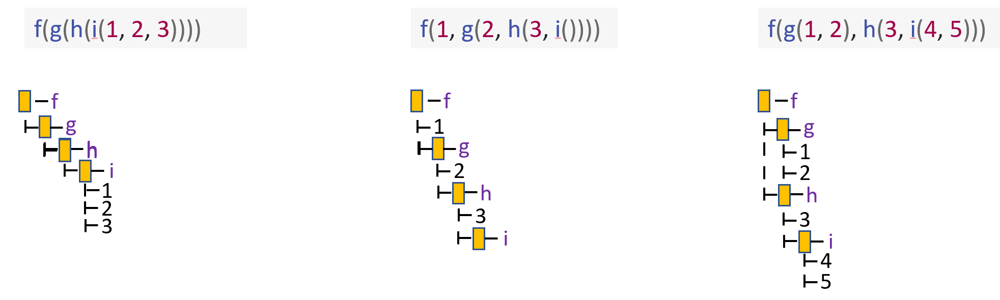

```{r setup, include=FALSE}
knitr::opts_chunk$set(echo = TRUE)
library(rlang)
library(lobstr)
```

## 18.1 Introduction

```{r, error = T}
y <- x * 10
```

```{r}
z <- rlang::expr(y <- x * 10)
z
```

```{r}
x <- 4
eval(z)
y
```

## 18.2 Abstract syntax trees

### 18.2.1 Drawing
```{r}
lobstr::ast(f(x, "y", 1))
```

```{r}
lobstr::ast(f(g(1, 2), h(3, 4, i())))
```

### 18.2.2 Non-code components

```{r}
ast(
  f(x,  y)  # important!
)
```

```{r}
lobstr::ast(y <- x)
```

```{r}
lobstr::ast(y < -x)
```

### 18.2.3 Infix calls

```{r}
y <- x * 10
`<-`(y, `*`(x, 10))
y
```

```{r}
lobstr::ast(y <- x * 10)
```

```{r}
expr(`<-`(y, `*`(x, 10)))
```

### 18.2.4 Exercises

1. Reconstruct the code represented by the trees below:
```{r, eval = FALSE}
# 1
f(g(h()))

# 2
1 + 2 + 3

# 3
(x + y) * z
```

2. Draw the following trees by hand and then check your answers with `lobstr::ast()`.



3. What’s happening with the ASTs below? (Hint: carefully read `?"^"`.)

```{r}
lobstr::ast(`x` + `y`)
```
Function `+` is being called with the symbols `x` and `y`

```{r}
lobstr::ast(x ** y)
```
Function `**` which is equal to `^` is being called with the symbols `x` and `y`

```{r}
lobstr::ast(1 -> x)
```
Function `<-` is being called on symbol `x` and assigning it the value of 1. In this case the assignment arrow gets flipped the other direction

4. What is special about the AST below? (Hint: re-read Section 6.2.1.)

```{r}
lobstr::ast(function(x = 1, y = 2) {})
```

x and y are now italicized to mean they are the default values. Inside { is empty but has a place holder

5. What does the call tree of an `if` statement with multiple `else if` conditions look like? Why?

```{r}
lobstr::ast(if(x == 1) {} else if(x == 2) {} else if(x == 3) {} else {})
```

Each if is nested inside the one above it. It looks this way because the interior else if do not run if the above if returns TRUE.

## 18.3 Expressions
### 18.3.1 Constants

```{r}
identical(expr(TRUE), TRUE)
identical(expr(1), 1)
identical(expr(2L), 2L)
identical(expr("x"), "x")
```

### 18.3.2 Symbols

```{r}
expr(x)
sym("x")
```

```{r}
as_string(expr(x))
```

```{r}
str(expr(x))
is.symbol(expr(x))
```

### 18.3.3 Calls

```{r}
lobstr::ast(read.table("important.csv", row.names = FALSE))
```

```{r}
x <- expr(read.table("important.csv", row.names = FALSE))

typeof(x)
is.call(x)
```

#### 18.3.3.1 Subsetting

```{r}
x[[1]]
is.symbol(x[[1]])
```

```{r}
as.list(x[-1])
```

```{r}
x[[2]]

x$row.names
```

```{r}
length(x) - 1
```

```{r}
rlang::call_standardise(x)
```

```{r}
x$header <- TRUE
x
```

#### 18.3.3.2 Function position

```{r}
lobstr::ast(foo())
```

```{r}
lobstr::ast("foo"())
```

```{r}
lobstr::ast(pkg::foo(1))

lobstr::ast(obj$foo(1))

lobstr::ast(foo(1)(2))
```

### 18.3.3.3 Constructing
```{r}
call2("mean", x = expr(x), na.rm = TRUE)
```

```{r}
call2(expr(base::mean), x = expr(x), na.rm = TRUE)
```

```{r}
call2("<-", expr(x), 10)
```

### 18.3.4 Summary

### 18.3.5 Exercises

1. Which two of the six types of atomic vector can’t appear in an expression? Why? Similarly, why can’t you create an expression that contains an atomic vector of length greater than one?

Raw and Complex. You need to use a function to create them. Use also need a function in order to create an atomic vector of length greater than 1.

2. What happens when you subset a call object to remove the first element? e.g. `expr(read.csv("foo.csv", header = TRUE))[-1]`. Why?

```{r}
x <- expr(read.csv("foo.csv", header = TRUE))
x

x[-1]
```
The first object in the expression vector is the function. In this case "foo.csv" becomes the new function since it is in position 1

3. Describe the differences between the following call objects.

```{r}
x <- 1:10
```

```{r}
call2(median, x, na.rm = TRUE)
```
```{r}
call2(expr(median), x, na.rm = TRUE)
```
```{r}
call2(median, expr(x), na.rm = TRUE)
```
```{r}
call2(expr(median), expr(x), na.rm = TRUE)
```

The first has useMethod(median) and 1:10, in this case both median and x are evaluated. The second one evaluates x  but not median. The third evaluates median but not x. The last does not evaluate median or x. All will evaluate the same once called, but the binding of the symbols occur at different times.

4. `rlang::call_standardise()` doesn’t work so well for the following calls. Why? What makes mean() special?

```{r}
call_standardise(quote(mean(1:10, na.rm = TRUE)))
```

```{r}
call_standardise(quote(mean(n = T, 1:10)))
```

```{r}
call_standardise(quote(mean(x = 1:10, , TRUE)))
```

Mean only takes one mandatory argument, `x`, but also has `...` which can't be standardized. Therefore it includes it as is.

5. Why does this code not make sense?

```{r}
x <- expr(foo(x = 1))
x
names(x)
lobstr::ast(foo(x = 1))

names(x) <- c("x", "y")
x

names(x)
x
```
The original names of x are "" and "x". We then change them to "x", and "y". In this case we are changing the name of x to y since x is the second element of the call. The first element name is irrelevant since it's the function.

6. Construct the expression `if(x > 1) "a" else "b"` using multiple calls to call2(). How does the code structure reflect the structure of the AST?

```{r}
lobstr::ast(if(x > 1) "a" else "b")
```

```{r}
call2("if", call2(">", sym("x"), 1), "a", "b")
```

```{r}
call2("if", call2(">", expr(x), 1), "a", "b")
# Have wrap x in sym or expr otherwise x gets evaluated
```

```{r}
call2("if", call2(">", x, 1), "a", "b")
```


Comparison gets called inside of the if statement and result determines return value.