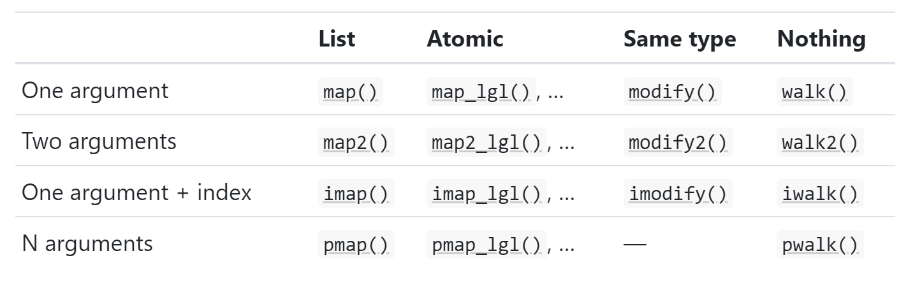

```{r setup, include=FALSE}
knitr::opts_chunk$set(echo = TRUE)
```

# 9. Functionals

## 9.1 Introduction

```{r}
randomise <- function(f) f(runif(1e3))
randomise(mean)
randomise(mean)
randomise(sum)
```

```{r}
library(purrr)
```

## 9.2 My first functional: `map()`

```{r}
triple <- function(x) x * 3
map(1:3, triple)
```

```{r}
simple_map <- function(x, f, ...) {
  out <- vector("list", length(x))
  for (i in seq_along(x)) {
    out[[i]] <- f(x[[i]], ...)
  }
  out
}
```

### 9.2.1 Producing atomic vectors

```{r}
map_chr(mtcars, typeof)
```

```{r}
map_lgl(mtcars, is.double)
```

```{r}
n_unique <- function(x) length(unique(x))
map_int(mtcars, n_unique)
```

```{r}
map_dbl(mtcars, mean)
```

```{r, error = T}
pair <- function(x) c(x, x)
map_dbl(1:2, pair)
```

```{r, error = T}
map_dbl(1:2, as.character)
```

```{r}
map(1:2, pair)
```

```{r}
map(1:2, as.character)
```

```{r, error = T}
map_dbl(x, mean, na.rm = TRUE)

=====
  
vapply(x, mean, na.rm = TRUE, FUN.VALUE = double(1))
```

### 9.2.2 Anonymous functions and shortcuts

```{r}
map_dbl(mtcars, function(x) length(unique(x)))
```

```{r}
map_dbl(mtcars, ~ length(unique(.x)))
```

```{r}
as_mapper(~ length(unique(.x)))
```

```{r}
x <- map(1:3, ~ runif(2))
str(x)
```

```{r}
x <- list(
  list(-1, x = 1, y = c(2), z = "a"),
  list(-2, x = 4, y = c(5, 6), z = "b"),
  list(-3, x = 8, y = c(9, 10, 11))
)
```

```{r}
map_dbl(x, "x")
```

```{r}
map_dbl(x, 1)
```

```{r}
map_dbl(x, list("y", 1))
```

```{r, error = T}
map_chr(x, "z")
```

```{r}
map_chr(x, "z", .default = NA)
```

### 9.2.3 Passing arguments with `...`

```{r}
x <- list(1:5, c(1:10, NA))
map_dbl(x, ~ mean(.x, na.rm = TRUE))
```

```{r}
map_dbl(x, mean, na.rm = TRUE)
```

```{r}
plus <- function(x, y) x + y

x <- c(0, 0, 0, 0)
map_dbl(x, plus, runif(1))
```

```{r}
map_dbl(x, ~ plus(.x, runif(1)))
```

### 9.2.4 Argument names

```{r, error = T}
boostrap_summary <- function(x, f) {
  f(sample(x, replace = TRUE))
}

simple_map(mtcars, boostrap_summary, f = mean)
```

### 9.2.5 Varying another argument

```{r}
trims <- c(0, 0.1, 0.2, 0.5)
x <- rcauchy(1000)
```

```{r}
map_dbl(trims, ~ mean(x, trim = .x))
```

```{r}
map_dbl(trims, function(trim) mean(x, trim = trim))
```

```{r}
map_dbl(trims, mean, x = x)
```

#### 9.2.6 Exercises

1.  Use `as_mapper()` to explore how purrr generates anonymous functions for the integer, character, and list helpers. What helper allows you to extract attributes? Read the documentation to find out.

```{r}
as_mapper(c("a", "b", "c"))
```

```{r}
as_mapper(c(1, 2, 3))
```

```{r}
as_mapper(list(1, "a", 2))
```

```{r}
as_mapper(list(1, attr_getter("a")))
```

Looks like it is using `pluck_raw`. Get attributes with `attr_getter`

2.  `map(1:3, ~ runif(2))` is a useful pattern for generating random numbers, but `map(1:3, runif(2))` is not. Why not? Can you explain why it returns the result that it does?

```{r}
map(1:3, ~ runif(2))
```

```{r}
map(1:3, runif(2))
```

```{r}
as_mapper(map(1:3, runif(2)))
```

```{r}
as_mapper(runif(2))
```


First one creates an anonymous function which then generates 2 random numbers for each of the 3 iterations. The second only generates one set of random numbers which is fed into map and results in maps default values being spit out when piped to `as_mapper`

3.  Use the appropriate `map()` function to:

-   Compute the standard deviation of every column in a numeric data frame

```{r}
mat <- as.data.frame(matrix(1:25, nrow = 5))
map_dbl(mat, ~ sd(.x))
```

-   Compute the standard deviation of every numeric column in a mixed data frame. (Hint: you'll need to do it in two steps.)

```{r}
summary(iris)
map_dbl(iris[map_lgl(iris, is.numeric)], ~ sd(.x))
```

-   Compute the number of levels for every factor in a data frame

```{r}
library(tidyverse)
summary(attenu)
df <- attenu %>%
  mutate(event = as.factor(event))
summary(df)

map_int(df[map_lgl(df, ~ is.factor(.x))], ~ length(levels(.x)))

```

4.  The following code simulates the performance of a t-test for non-normal data. Extract the p-value from each test, then visualise.

```{r}
trials <- map(1:100, ~ t.test(rpois(10, 10), rpois(7, 10)))

map_dbl(trials, "p.value") %>%
  hist(main = "Histogram of p values")
```

5.  The following code uses a map nested inside another map to apply a function to every element of a nested list. Why does it fail, and what do you need to do to make it work?

```{r, error = T}
x <- list(
  list(1, c(3, 9)),
  list(c(3, 6), 7, c(4, 7, 6))
)

triple <- function(x) x * 3
map(x, map, .f = triple)

map(x, map, triple)
# or
map(x, ~ map(.x, triple))
```

Using .f makes triple the function of the outer map call and not the inner map call. Just remove the name and it will go in order and work

6.  Use `map()` to fit linear models to the mtcars dataset using the formulas stored in this list:

```{r}
formulas <- list(
  mpg ~ disp,
  mpg ~ I(1 / disp),
  mpg ~ disp + wt,
  mpg ~ I(1 / disp) + wt
)

map(formulas, lm, data = mtcars)
```

7.  Fit the model `mpg ~ disp` to each of the bootstrap replicates of `mtcars` in the list below, then extract the $R^2$ of the model fit (Hint: you can compute the $R^2$ with summary().)

```{r}
bootstrap <- function(df) {
  df[sample(nrow(df), replace = TRUE), , drop = FALSE]
}

bootstraps <- map(1:10, ~ bootstrap(mtcars))
head(bootstraps)

map(bootstraps, ~ lm(mpg ~ disp, data = .x)) %>%
  map(summary) %>%
  map("r.squared")
```

## 9.3 Purrr style

```{r}
by_cyl <- split(mtcars, mtcars$cyl)
```

```{r}
by_cyl %>% 
  map(~ lm(mpg ~ wt, data = .x)) %>% 
  map(coef) %>% 
  map_dbl(2)
```

```{r}
by_cyl %>% 
  lapply(function(data) lm(mpg ~ wt, data = data)) %>% 
  lapply(coef) %>% 
  vapply(function(x) x[[2]], double(1))
```

```{r}
models <- lapply(by_cyl, function(data) lm(mpg ~ wt, data = data))
vapply(models, function(x) coef(x)[[2]], double(1))
```

```{r}
slopes <- double(length(by_cyl))
for (i in seq_along(by_cyl)) {
  model <- lm(mpg ~ wt, data = by_cyl[[i]])
  slopes[[i]] <- coef(model)[[2]]
}
slopes
```

### 9.4 Map variants



### 9.4.1 Same type of output as input: `modify()`

```{r}
df <- data.frame(
  x = 1:3,
  y = 6:4
)

map(df, ~ .x * 2)
```

```{r}
modify(df, ~ .x * 2)
```

```{r}
df <- modify(df, ~ .x * 2)
df
```

```{r}
simple_modify <- function(x, f, ...) {
  for (i in seq_along(x)) {
    x[[i]] <- f(x[[i]], ...)
  }
  x
}
```

```{r}
modify_if(df, is.numeric, ~ .x * 2)
```


### 9.4.2 Two inputs: `map2()` and friends

```{r}
xs <- map(1:8, ~ runif(10))
xs[[1]][[1]] <- NA
ws <- map(1:8, ~ rpois(10, 5) + 1)
```

```{r}
map_dbl(xs, mean)
```

```{r, error = T}
map_dbl(xs, weighted.mean, w = ws)
```

```{r}
map2_dbl(xs, ws, weighted.mean)
```

```{r}
map2_dbl(xs, ws, weighted.mean, na.rm = TRUE)
```

```{r}
simple_map2 <- function(x, y, f, ...) {
  out <- vector("list", length(x))
  for (i in seq_along(x)) {
    out[[i]] <- f(x[[i]], y[[i]], ...)
  }
  out
}
```

### 9.4.3 No outputs: `walk()` and friends

```{r}
welcome <- function(x) {
  cat("Welcome ", x, "!\n", sep = "")
}
names <- c("Hadley", "Jenny")

map(names, welcome)
```

```{r}
walk(names, welcome)
```

```{r}
temp <- tempfile()
dir.create(temp)

cyls <- split(mtcars, mtcars$cyl)
paths <- file.path(temp, paste0("cyl-", names(cyls), ".csv"))
walk2(cyls, paths, write.csv)

dir(temp)
```

### 9.4.4 Iterating over values and indices

```{r}
imap_chr(iris, ~ paste0("The first value of ", .y, " is ", .x[[1]]))
```

```{r}
x <- map(1:6, ~ sample(1000, 10))
imap_chr(x, ~ paste0("The highest value of ", .y, " is ", max(.x)))
```

### 9.4.5 Any number of inputs: pmap() and friends

```{r}
pmap_dbl(list(xs, ws), weighted.mean)
```

```{r}
pmap_dbl(list(xs, ws), weighted.mean, na.rm = T)
```

```{r}
trims <- c(0, 0.1, 0.2, 0.5)
x <- rcauchy(1000)

pmap_dbl(list(trim = trims), mean, x = x)
```

```{r}
params <- tibble::tribble(
  ~ n, ~ min, ~ max,
   1L,     0,     1,
   2L,    10,   100,
   3L,   100,  1000
)

# runif(n, min, max)
pmap(params, runif)
```

#### 9.4.6 Exercises

1. Explain the results of `modify(mtcars, 1)`

```{r}
modify(mtcars, 1)
```

The rows are all the same. The call extracts the first row of the `mtcars` data frame. Then since modify returns the same size output as input, it just recycles it for the original length of `mtcars`

2. Rewrite the following code to use `iwalk()` instead of `walk2()`. What are the advantages and disadvantages?

```{r}
cyls <- split(mtcars, mtcars$cyl)
paths <- file.path(temp, paste0("cyl-", names(cyls), ".csv"))
walk2(cyls, paths, write.csv)

names(cyls) <- paths
iwalk(cyls, ~write.csv(.x, .y))
```

3. Explain how the following code transforms a data frame using functions stored in a list.

```{r}
trans <- list(
  disp = function(x) x * 0.0163871,
  am = function(x) factor(x, labels = c("auto", "manual"))
)

nm <- names(trans)
mtcars[nm] <- map2(trans, mtcars[nm], function(f, var) f(var))
```

Compare and contrast the map2() approach to this map() approach:

```{r}
mtcars[nm] <- map(nm, ~ trans[[.x]](mtcars[[.x]]))
```


The two functions in the list are disp for displacement which calculates displacement with a fixed value and am which converts the column to a factor column of either auto or manual for levels. nm is the names of the functions. The function them modifies the the two columns of mtcars which match the names of the two functions by iterating over similar indexes. In this case f would be our x and var would be our y. The second directly iterates over the names contained in the nm object

4. What does `write.csv()` return, i.e. what happens if you use it with `map2()` instead of `walk2()`

```{r}
cyls <- split(mtcars, mtcars$cyl)
paths <- file.path(temp, paste0("cyl-", names(cyls), ".csv"))
walk2(cyls, paths, write.csv)
map2(cyls, paths, write.csv)

```

It returns a list of length 3 with NULL as the return value which we don't care about.

## 9.5 Reduce family

### 9.5.1 Basics
```{r}
l <- map(1:4, ~ sample(1:10, 15, replace = T))
str(l)
```

```{r}
out <- l[[1]]
out <- intersect(out, l[[2]])
out <- intersect(out, l[[3]])
out <- intersect(out, l[[4]])
out
```

```{r}
reduce(l, intersect)
```

```{r}
reduce(l, union)
```

```{r}
simple_reduce <- function(x, f) {
  out <- x[[1]]
  for (i in seq(2, length(x))) {
    out <- f(out, x[[i]])
  }
  out
}
```

### 9.5.2 Accumulate

```{r}
accumulate(l, intersect)
```

```{r}
x <- c(4, 3, 10)
reduce(x, `+`)
```

```{r}
accumulate(x, `+`)
```

### 9.5.3 Output types

```{r}
reduce(1, `+`)
```

```{r}
reduce("a", `+`)
```

```{r, error = T}
reduce(integer(), `+`)
```

```{r}
reduce(integer(), `+`, .init = 0)
```

```{r, error = T}
reduce("a", `+`, .init = 0)
```

```{r}
sum(integer())  # x + 0 = x
prod(integer()) # x * 1 = x
min(integer())  # min(x, Inf) = x
max(integer())  # max(x, -Inf) = x
```

### 9.5.4 Multiple inputs

### 9.5.5 Map-reduce

## 9.6 Predicate functionals
### 9.6.1 Basics
```{r}
df <- data.frame(x = 1:3, y = c("a", "b", "c"))
detect(df, is.factor)
```

```{r}
detect_index(df, is.factor)
```

```{r}
str(keep(df, is.factor))
```

```{r}
str(discard(df, is.factor))
```

### 9.6.2 Map variants

```{r}
df <- data.frame(
  num1 = c(0, 10, 20),
  num2 = c(5, 6, 7),
  chr1 = c("a", "b", "c"),
  stringsAsFactors = FALSE
)
df
```

```{r}
str(map_if(df, is.numeric, mean))
```

```{r}
str(modify_if(df, is.numeric, mean))
```

```{r}
str(map(keep(df, is.numeric), mean))
```

#### 9.6.3 Exercises

1. Why isn’t `is.na()` a predicate function? What base R function is closest to being a predicate version of `is.na()`?

```{r}
is.na(1)
is.na(c(1,2))
is.na(c(NA,1,2))

anyNA(1)
anyNA(c(1,2))
anyNA(c(1,2,NA))
```

`is.na)` is not a predicate function because it returns a T or F for each element in the vector rather than just a single T or F. The closest base R function is `anyNA()`

2. `simple_reduce()` has a problem when x is length 0 or length 1. Describe the source of the problem and how you might go about fixing it.

```{r, error = T}
# Original
simple_reduce <- function(x, f) {
  out <- x[[1]]
  for (i in seq(2, length(x))) {
    out <- f(out, x[[i]])
  }
  out
}

simple_reduce(c(1,2,3), `+`)
simple_reduce(c(1), `+`)

new_simple_reduce <- function(x, f) {
  if(length(x) < 2) return(x)
  out <- x[[1]]
  for (i in seq(2, length(x))) {
    out <- f(out, x[[i]])
  }
  out
}

new_simple_reduce(c(1,2,3), `+`)
new_simple_reduce(c(1), `+`)
```

`simple_reduce()` uses indexing which is hard coded to expect at least a length of 2. This can be fixed by checking the length of x before the for loop and assigning out.

3. Implement the `span()` function from Haskell: given a list `x` and a predicate function `f`, `span(x, f)` returns the location of the longest sequential run of elements where the predicate is true. (Hint: you might find `rle()` helpful.)

```{r}
## (a -> Bool) -> [a] -> ([a], [a])
x <- map(1:4, ~ sample(1:10, 10, replace = T))
f <- function(l) l %% 2 == 0
str(x)

span <- function(x, f){
  logic_vector <- map(x, ~ f(.x))
  out <- map(logic_vector, ~rle(.x))
  maxes <- map(out, ~ max(.x[["lengths"]][.x[["values"]] == T]))
  idx <- map2(out, maxes, ~ which(.x[["lengths"]] == .y &
                                   .x[["values"]] == T))
  positions <- map2(out,
                    idx,
                    function(x, y) {
                      map(y, function(y2) {
                        if (y2 == 1) {
                          y2
                        } else {
                          sum(unlist(x[["lengths"]][1:(y2 - 1)])) + 1
                        }
                      })
                    })
  map(positions, unlist)
}
span(x,f)
```